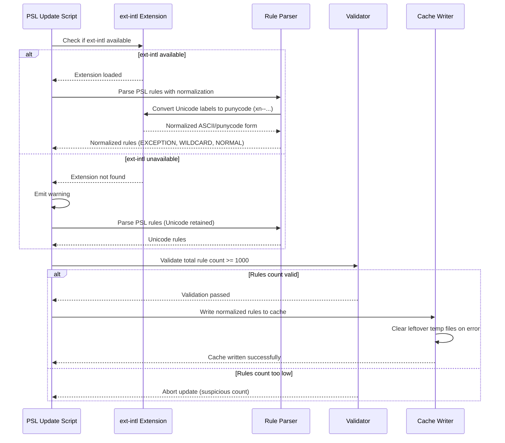

# RegDom Architecture

This document describes the internal architecture of the RegDom library, including
the PSL cache format, rule matching logic, domain normalization, and the update pipeline.

## Project Structure

```text
src/
  RegisteredDomain.php            Main API class
  PublicSuffixList.php             PSL cache loader and query engine
  Exception/
    PslCacheNotFoundException.php  Thrown when no valid cache is found
bin/
  update-psl.php                  Downloads PSL from publicsuffix.org, builds cache
  reloadpsl                       Convenience wrapper for update-psl.php
data/
  psl.cache.php                   Bundled PSL cache (PHP array, ~200 KB)
  psl.meta.json                   Download metadata (ETag, Last-Modified)
```

## Class Overview

### `RegisteredDomain`

The main API class. Provides two public methods:

- **`getRegisteredDomain(string $host, bool $utf8 = true): ?string`**
  Extracts the registrable domain from a hostname or URL.
  Accepts bare hosts (`www.example.co.uk`), full URLs (`https://example.com/path`),
  hosts with ports (`example.com:8080`), and IDN labels (`www.munchen.de`).
  Returns `null` for IP addresses, localhost, public suffixes, and unrecognized TLDs.

- **`domainMatches(string $host, string $domain): bool`** *(static)*
  Validates whether a cookie domain is appropriate for a given host, following
  RFC 6265 rules and PSL conventions. Rejects public suffixes, IP addresses,
  localhost, and cross-domain mismatches.

### `PublicSuffixList`

Manages and queries the PSL data loaded from a pre-generated cache. Provides:

- **`isPublicSuffix(string $domain): bool`** -- Checks if a domain is a public suffix.
- **`getPublicSuffix(string $domain): ?string`** -- Returns the public suffix portion
  of a domain (e.g. `www.example.co.uk` returns `co.uk`).
- **`isException(string $domain): bool`** -- Checks if a domain is a PSL exception
  entry (e.g. `www.ck`, `city.kawasaki.jp`).
- **`getMetadata(): array`** -- Returns cache age, rule counts, and a staleness flag.

The `$rules` property is **static** -- shared across all instances within a single
PHP request. This avoids reloading the ~200 KB cache file on every instantiation.

## PSL Cache Format

The cache file (`data/psl.cache.php`) is a plain PHP `return` statement that yields
an associative array with three keys:

```php
return [
    'NORMAL'    => ['com' => true, 'co.uk' => true, ...],
    'WILDCARD'  => ['ck' => true, 'kawasaki.jp' => true, ...],
    'EXCEPTION' => ['www.ck' => true, 'city.kawasaki.jp' => true, ...],
];
```

| Key         | Meaning                              | Example PSL Entry   | Stored Key     |
|-------------|--------------------------------------|---------------------|----------------|
| `NORMAL`    | Exact public suffix                  | `com`               | `com`          |
| `WILDCARD`  | Wildcard rule (all children are PS)  | `*.ck`              | `ck`           |
| `EXCEPTION` | Exception to a wildcard rule         | `!www.ck`           | `www.ck`       |

All keys are stored in ASCII/punycode form (e.g. `xn--55qx5d.cn` instead of
Unicode). This matches the normalization applied at query time, so lookups
are simple `isset()` hash checks -- O(1).

### Dual Cache Paths

The library checks two locations, in order:

1. **Runtime cache** (preferred): `XOOPS_VAR_PATH/cache/regdom/psl.cache.php`
   Used in a full XOOPS installation where the constant is defined.
2. **Bundled fallback**: `data/psl.cache.php`
   Shipped with the package for standalone or non-XOOPS usage.

Both files undergo validation before use:
- File size must be between 100 KB and 10 MB (rejects corrupt/empty files)
- Must return an array with all three keys (`NORMAL`, `WILDCARD`, `EXCEPTION`)
- Each key must be an array
- Total rule count must be between 1,000 and 100,000

## Rule Matching Priority

The PSL specification defines a strict priority order:

1. **Exception rules** -- checked first; if a domain matches an exception entry
   (e.g. `city.kawasaki.jp`), it is *not* a public suffix, even though a wildcard
   rule (`*.kawasaki.jp`) would otherwise match.
2. **Normal rules** -- exact suffix match (e.g. `com`, `co.uk`).
3. **Wildcard rules** -- if the parent domain matches a wildcard key
   (e.g. `anything.ck` matches wildcard `ck`).

### Exception Rule Semantics

PSL exception rules are prefixed with `!` in the raw data (e.g. `!city.kawasaki.jp`).
They mean: "this specific label is *not* part of the public suffix, even though a
wildcard would otherwise claim it."

For `getPublicSuffix()`, the public suffix of an exception domain is the exception
entry minus its leftmost label:

```text
PSL entry:     !city.kawasaki.jp
Exception key: city.kawasaki.jp
Public suffix:        kawasaki.jp   (one label removed)
```

This means `city.kawasaki.jp` is itself a registrable domain, not a public suffix.

## Domain Normalization

Both classes normalize input before processing:

### `RegisteredDomain::normalizeHost()`

Handles the full range of inputs:
- Strips scheme and path from URLs via `parse_url()`
- Lowercases via `mb_strtolower()` (UTF-8 aware)
- Strips trailing port numbers (`:8080`)
- Strips trailing dots (`example.com.`)
- Handles bracketed IPv6 literals (`[::1]`, `[::1]:443`)
- Detects unbracketed IPv6 (from `parse_url()`) and skips port stripping to
  avoid corrupting the address

### `PublicSuffixList::normalizeDomain()`

Simpler normalization for PSL queries:
- Lowercases and trims
- Strips leading/trailing dots
- Converts Unicode labels to punycode via `idn_to_ascii()` (when `ext-intl` is available)

## IDN / Punycode Handling

Internationalized domain names (IDN) are handled at two levels:

1. **Cache generation** (`bin/update-psl.php`): All PSL rules are normalized to
   ASCII/punycode before storage. This ensures that Unicode rules like
   `xn--55qx5d.cn` are reachable regardless of input form.

2. **Query time**: Input domains are converted to punycode via `idn_to_ascii()`
   before lookup. Results can be converted back to UTF-8 via `idn_to_utf8()` for
   display (controlled by the `$utf8` parameter on `getRegisteredDomain()`).

Both conversions require `ext-intl`. When the extension is not available:
- Punycode input (e.g. `xn--55qx5d.cn`) still works correctly
- Unicode input (e.g. `公司.cn`) cannot be converted and may not match

## PSL Update Pipeline

The `bin/update-psl.php` script downloads the latest PSL from
[publicsuffix.org](https://publicsuffix.org/list/public_suffix_list.dat),
parses the rules, and writes the cache atomically.



### Update Details

- **HTTP conditional downloads**: Uses `ETag` and `Last-Modified` headers from
  previous downloads (stored in `data/psl.meta.json`) to avoid re-downloading
  unchanged data (HTTP 304 Not Modified).

- **Rule parsing**: Each line of the raw PSL is classified as:
  - `!prefix` -> `EXCEPTION` (stored without the `!`)
  - `*.suffix` -> `WILDCARD` (stored without the `*.`)
  - Everything else -> `NORMAL`

- **Atomic writes**: Cache content is written to a temp file first, then renamed
  into place via `rename()`. This prevents partial reads if the cache is loaded
  concurrently. After writing, `opcache_invalidate()` is called to ensure PHP
  picks up the new file.

- **Dual targets**: The script writes to both the bundled path (`data/psl.cache.php`)
  and, if available, the runtime path (`XOOPS_VAR_PATH/cache/regdom/psl.cache.php`).

## XOOPS Integration

When used within a XOOPS installation, three constants affect behavior:

| Constant                       | Purpose                                         |
|--------------------------------|-------------------------------------------------|
| `XOOPS_VAR_PATH`              | Base path for the runtime PSL cache directory    |
| `XOOPS_COOKIE_DOMAIN_USE_PSL` | Set to `false` to disable PSL validation in `domainMatches()` |
| `XOOPS_SKIP_PSL_UPDATE`       | Environment variable; skips auto-update during Composer hooks  |

When none of these constants are defined, the library operates in standalone mode
using only the bundled cache file.
